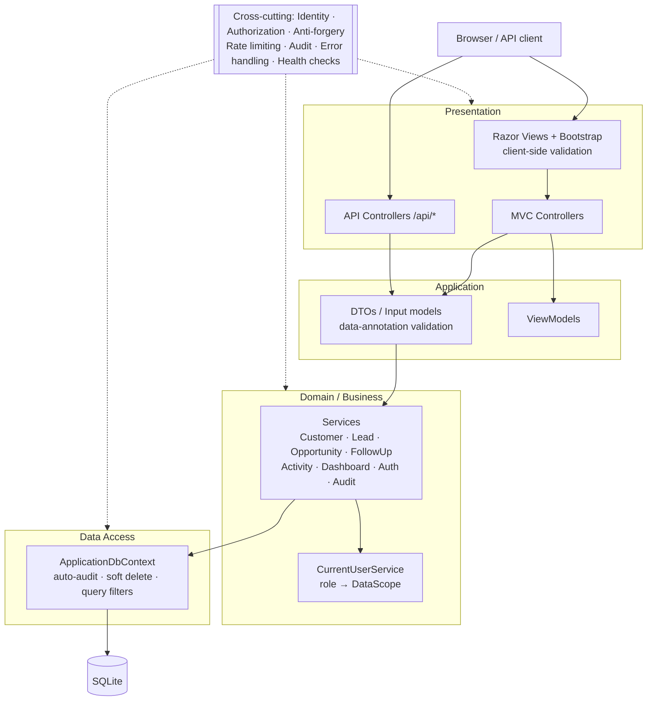
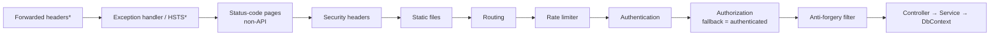
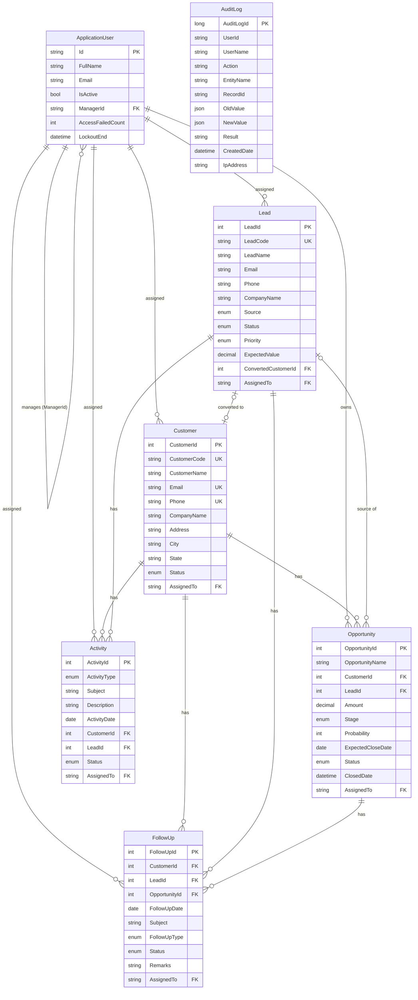
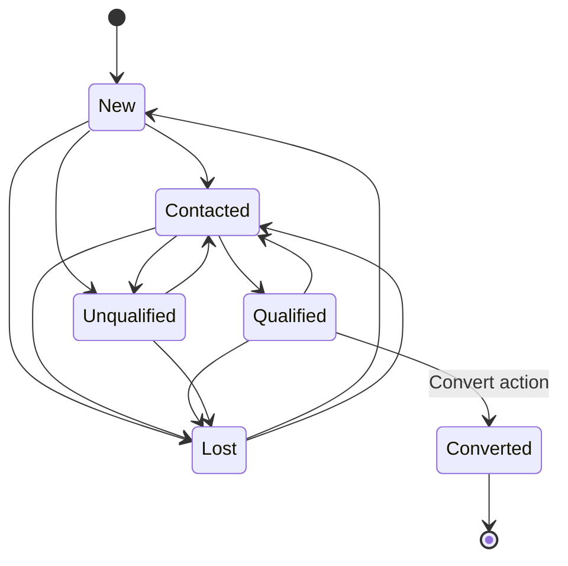
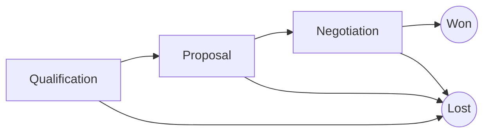
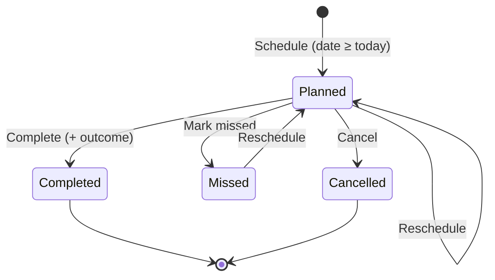
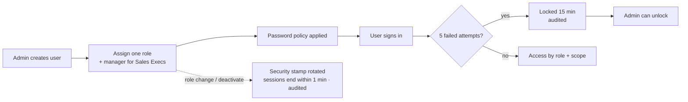
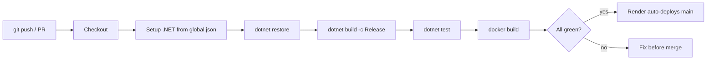

# AcxiomCRM

**A role-based Customer Relationship Management system built with ASP.NET Core 8.**

[](https://acxiomcrm-go4x.onrender.com)

🌐 **Live demo:** https://acxiomcrm-go4x.onrender.com
 (Hosted on a free plan: the first load may take about a minute, and data resets when the service sleeps)

AcxiomCRM covers the full customer-sales lifecycle: lead capture, qualification and conversion, an opportunity pipeline, follow-ups and activity tracking. It is built with production-oriented engineering:

- ASP.NET Core Identity authentication with password policy and lockout
- Server-side, role-based data scoping
- Two-layer (client + server) validation with business rules
- An append-only audit trail
- A documented REST API
- Docker packaging and CI

[](https://dotnet.microsoft.com/)
[](https://learn.microsoft.com/aspnet/core)
[](https://learn.microsoft.com/ef/core)
[](https://www.sqlite.org/)
[](https://getbootstrap.com/)
[](https://www.chartjs.org/)
[](https://www.docker.com/)

<!--
SCREENSHOTS (recommended): save images in docs/screenshots/ and uncomment the block below.

## Screenshots

| Admin dashboard | Sales pipeline (Kanban) |
|---|---|
|  |  |

| Audit log | Lead conversion |
|---|---|
|  |  |
-->

---

## Table of contents

1. [Demo login credentials](#1-demo-login-credentials)
2. [Feature overview](#2-feature-overview)
3. [Technology stack](#3-technology-stack)
4. [Architecture](#4-architecture)
5. [Data model](#5-data-model)
6. [Business workflows](#6-business-workflows)
7. [Role-based access control](#7-role-based-access-control)
8. [Validation](#8-validation)
9. [Security](#9-security)
10. [Audit logging](#10-audit-logging)
11. [Dashboard & analytics](#11-dashboard--analytics)
12. [REST API reference](#12-rest-api-reference)
13. [Project structure](#13-project-structure)
14. [Getting started (local)](#14-getting-started-local)
15. [Configuration reference](#15-configuration-reference)
16. [CI pipeline](#16-ci-pipeline)
17. [Acceptance test walkthrough](#17-acceptance-test-walkthrough)
18. [Module checklist](#18-module-checklist)
19. [Roadmap](#19-roadmap)
20. [Bonus: Deployment & live demo](#20-bonus-deployment--live-demo)

---

## 1. Demo login credentials

When the app runs in **Development** mode (see [Getting started](#14-getting-started-local)), it seeds one account per role plus sample customers, leads, opportunities, follow-ups and activities. Sign in as each one to see how the interface and data change by role.

| Role | Email | Password | Name | What to look for |
|---|---|---|---|---|
| **Admin** | `admin@acxiomcrm.test` | `Admin@Crm2026` | Asha Admin | Indigo theme · **Organisation Dashboard** · all records · Administration menu (Users, Roles, Permissions, Audit Log) |
| **Manager** | `manager@acxiomcrm.test` | `Manager@Crm2026` | Manoj Manager | Teal theme · **Team Dashboard** with per-rep performance · team records · can delete · no admin menu |
| **Sales Executive** | `sales1@acxiomcrm.test` | `Sales1@Crm2026` | Sameer Sales | Blue theme · **My Dashboard** ("My Day") · only own records · no delete, no assignment |
| **Sales Executive** | `sales2@acxiomcrm.test` | `Sales2@Crm2026` | Divya Deshpande | Same as above, with a different set of records |

> Both Sales Executives report to the Manager. Signing in as **Sameer Sales** and then **Divya Deshpande** shows that each rep sees a different, non-overlapping set of customers. Opening one of the other rep's records by editing the URL returns **404**.

These are demo accounts for local and evaluation use only. They are defined in `src/AcxiomCRM/appsettings.Development.json`, which is excluded from publish output and Docker images. Production environments create their administrator from environment variables (see [Bonus: Deployment](#20-bonus-deployment--live-demo)).

**Lockout:** 5 wrong passwords lock an account for 15 minutes. Sign in as Admin → Administration → Users → **Unlock**.

---

## 2. Feature overview

| Module | Capabilities |
|---|---|
| **Authentication** | Login, Register (self-registered users become Sales Executives), Logout, Change Password, account lockout, deactivated-user blocking |
| **Dashboard** | Role-specific KPI cards, date-range filter (Today / This Week / This Month / Custom), Chart.js charts, team-performance table, "My Day" panel, recent system activity |
| **Customer Management** | Create / Edit / Details / Delete (soft) / Search, sorting, paging, uniqueness and duplicate checks, related opportunities, follow-ups, activities and change history |
| **Lead Management** | CRUD, status workflow with enforced transitions, priority, source, expected value, **Lead → Customer (+ Opportunity) conversion** |
| **Opportunity Management** | CRUD, stages Qualification → Proposal → Negotiation → Won/Lost, weighted amount, Kanban **Sales Pipeline** board |
| **Follow-Up** | Schedule, **Pending Follow-Ups** (Overdue / Today / Next 7 days / Later), Complete with outcome, Mark Missed, Cancel, Reschedule |
| **Activity Management** | Calls, Meetings, Emails, Tasks, linked to customers or leads |
| **User & Role Management** | Users (create, edit, activate/deactivate, unlock, reset password), Roles (members per role), Permissions matrix |
| **Audit Log** | Append-only log of Login / Create / Update / Delete / Role and security events, with readable field-level diffs, filters and tabs |
| **REST API** | JSON endpoints for auth, customers, leads, opportunities, follow-ups and a pipeline report |

---

## 3. Technology stack

| Layer | Technology |
|---|---|
| Runtime | .NET 8 (LTS), C# 12 |
| Web framework | ASP.NET Core 8 MVC (Razor views) + API controllers |
| Authentication | ASP.NET Core Identity (cookie auth, PBKDF2 password hashing, lockout, security stamps) |
| ORM / data | Entity Framework Core 8, code-first migrations |
| Database | SQLite (single file; swappable for SQL Server through the EF provider) |
| UI | Bootstrap 5, Bootstrap Icons, jQuery Unobtrusive Validation |
| Charts | Chart.js 4 |
| API | JSON with `System.Text.Json`, string enums, RFC 7807 ProblemDetails errors |
| Ops | Rate limiting (`System.Threading.RateLimiting`), Health Checks, Data Protection key persistence, forwarded headers |
| Packaging | Multi-stage Dockerfile, docker-compose |
| CI | GitHub Actions |

---

## 4. Architecture

The application follows a **layered architecture**. Controllers stay thin, and all business rules and data-access scoping live in services, so the MVC pages and the REST API share exactly the same rules.



### Request pipeline



\* enabled by configuration / environment

### Key design decisions

| Decision | Reason |
|---|---|
| **Data scoping in services** (`VisibleTo(scope)` on every query) | Authorization can't be bypassed by editing a URL or calling the API directly. Out-of-scope records simply don't exist for that user, so the response is 404. |
| **Shared input DTOs** for forms and API | One set of validation attributes, one set of business rules |
| **Auditing in `SaveChangesAsync`** | Every create, update and delete is captured automatically, so no service can forget to log |
| **Soft delete + global query filters** | History and audit trail stay intact. Uniqueness indexes are filtered to non-deleted rows. |
| **`ServiceResult`** (Validation / NotFound / Conflict) | Services stay HTTP-agnostic. MVC maps results to ModelState; the API maps them to 400 / 404 / 409. |
| **Enums stored as strings, decimals as REAL** | Readable data, and SQLite can `SUM`/`ORDER BY` money columns |

---

## 5. Data model



Every CRM entity also carries `CreatedDate`, `CreatedBy`, `ModifiedDate`, `ModifiedBy` and `IsDeleted`, filled in automatically by the DbContext. Identity tables (`AspNetUsers`, `AspNetRoles`, …) are managed by ASP.NET Core Identity; there is **no custom password table**.

---

## 6. Business workflows

### 6.1 Lead lifecycle and conversion



- Transitions are enforced on the server (`LeadService.Transitions`). Invalid changes are rejected with *"Lead status cannot change from X to Y"*.
- **Converted** can only be reached through **Convert**, which runs in a single database transaction:
  1. Reuses an existing customer with the same email, or creates a new one.
  2. Optionally creates an opportunity linked to the lead.
  3. Marks the lead Converted and records `ConvertedDate` and `ConvertedCustomerId`.
  4. Writes a `Convert` audit entry.
- Converted leads are read-only and cannot be deleted, so conversion reporting stays accurate.

### 6.2 Opportunity pipeline



| Rule | Behaviour |
|---|---|
| Amount | Must be **> 0** |
| Probability | **0–100**. Forced to 100 on *Won* and 0 on *Lost*. |
| Expected close date | Cannot be in the past while the opportunity is **open** |
| Status | Derived from the stage (Open / Won / Lost). `ClosedDate` is stamped on close. |
| Weighted amount | `Amount × Probability ÷ 100` |
| Reopening | Only an Admin or Manager can move a closed opportunity back to an open stage |

### 6.3 Follow-up workflow



- Each follow-up must be linked to at least one customer, lead or opportunity.
- A planned follow-up dated before today is shown as **Overdue**.
- Every status change and reschedule is captured in the audit trail.

### 6.4 User administration



---

## 7. Role-based access control

Authorization is enforced **on the server** at two levels:

1. **Endpoint level:** a fallback policy requires authentication everywhere, plus `[Authorize(Roles = ...)]` on admin and delete actions.
2. **Record level:** each service filters queries through a `DataScope` computed for the current user.

| Module | Admin | Manager | Sales Executive |
|---|---|---|---|
| Dashboard | Organisation-wide | Team | Own |
| Customers / Leads / Opportunities / Follow-Ups / Activities | All | Own + direct reports + unassigned | Own (assigned) only |
| Assign records to | Any active user | Team members | Always self |
| Delete CRM records | ✅ | ✅ (team scope) | ❌ (403) |
| Users / Roles / Permissions | ✅ | ❌ | ❌ |
| Audit Log | ✅ | ❌ | ❌ |
| `GET /api/reports/pipeline` | All data | Team data | ❌ (403) |

A Manager's team is defined by `ApplicationUser.ManagerId`: Sales Executives who report to that manager.

---

## 8. Validation

Validation runs in **three layers**. The client layer is for user experience only, because it can be bypassed; the server layers are what actually enforce the rules.

| Layer | Implementation |
|---|---|
| Client | jQuery Unobtrusive Validation generated from the same data annotations, plus a custom `notpast` adapter (`wwwroot/js/validation.js`) |
| Server: model | Data annotations on the input DTOs, checked by MVC/API model binding and **re-run inside every service** |
| Server: business | Service rules: uniqueness, duplicate customer, status transitions, scope checks on foreign keys, date and amount rules |

| Field | Rule | Message |
|---|---|---|
| Required fields | Not empty | Field-specific, e.g. *"Customer Name is required."* |
| Email | `local@domain.tld` pattern | *"Enter a valid email address."* |
| Phone | 10-digit Indian mobile, `^[6-9]\d{9}$` | *"Enter a valid phone number."* |
| Lengths | Max lengths matching the DB columns | *"{Field} cannot exceed N characters."* |
| Opportunity amount | > 0 | *"Opportunity Amount must be greater than 0."* |
| Probability | 0–100 | *"Probability must be between 0 and 100."* |
| Expected close date | Not in the past while open (custom `[NotInPast]`) | *"Expected Close Date cannot be in the past."* |
| Follow-up date | Not before today | *"Follow-up date cannot be earlier than today."* |
| Customer email / phone | Unique among active customers | *"A customer with this email already exists."* (API: **409**) |
| Duplicate customer | Same name + company rejected | *"This customer already exists for the same company."* |
| Lead status | Valid enum and an allowed transition | *"Lead status cannot change from X to Y."* |

---

## 9. Security

| Control | Implementation |
|---|---|
| Password storage | ASP.NET Core Identity hashing (PBKDF2). Hashes are never exposed in views, DTOs, API responses or logs. |
| Password policy | 8+ characters, with upper case, lower case, a digit and a symbol, and at least 4 unique characters (configurable) |
| Account lockout | 5 failed attempts → 15-minute lockout (configurable). Admin unlock. Lockouts are audited. |
| Brute-force throttling | Fixed-window rate limit on `/Account/Login`, `/Account/Register` and `/api/auth/login` (HTTP 429) |
| Session security | `HttpOnly`, `SameSite=Strict` and `Secure` (outside Development) cookies; 60-minute sliding expiry; security stamp re-validated every minute |
| Deactivated users | Blocked by a custom `SignInManager.CanSignInAsync`; existing sessions are invalidated |
| Authorization | Fallback policy (authenticated by default), role attributes, record-level data scoping |
| CSRF | Global `AutoValidateAntiforgeryToken` plus `[ValidateAntiForgeryToken]` on every MVC POST. The API relies on SameSite=Strict cookies. |
| SQL injection | EF Core LINQ only; no raw SQL or string concatenation |
| Open redirects | Login only follows local `returnUrl`s (`Url.IsLocalUrl`) |
| Error handling | Generic error pages in production. The API returns ProblemDetails without stack traces. |
| Security headers | `X-Content-Type-Options: nosniff`, `X-Frame-Options: DENY`, `Referrer-Policy`; HSTS in production |
| Secrets | No production credentials in source control. The first admin comes from environment variables, and `.env` is git-ignored. |
| Key management | Data-protection keys persisted to the data volume, so sessions survive restarts |

---

## 10. Audit logging

| Event | How it is captured |
|---|---|
| Create / Update / Delete of any CRM entity | Automatically in `ApplicationDbContext.SaveChangesAsync`, with old and new values of the changed fields |
| Login, Logout, Failed login, Lockout, Register | `AuthService` → `AuditService` |
| Role change, activation/deactivation, unlock, password reset/change | `UsersController` / `AccountController` → `AuditService` |
| Lead conversion | `LeadService.ConvertAsync` |

- Each record stores `UserId`, `UserName`, `Action`, `EntityName`, `RecordId`, `OldValue`, `NewValue` (JSON), `Result`, `CreatedDate` (UTC) and `IpAddress`.
- **Append-only:** the DbContext throws if code tries to modify or delete an `AuditLog` row.
- **Readable history:** record pages show *Field: old → new* (enum names, ₹ amounts, dates, user names) rather than raw JSON.
- **Admin Audit Log page:** tabs for **Login / Create / Update / Delete**, plus filters by user, module, action and date range.

---

## 11. Dashboard & analytics

| Element | Admin | Manager | Sales Executive |
|---|---|---|---|
| Heading | Organisation Dashboard | Team Dashboard | My Dashboard |
| Banner | Security summary (active / locked users, failed logins today) | Team overview | **My Day**: follow-ups due today and overdue, plus quick actions |
| Team performance table | All Sales Executives | Direct reports | — |
| Recent system activity | ✅ | — | — |

Every role also gets:

- **KPI cards:** Total Customers · Total Leads · Open Leads · Total / Open / Won / Lost Opportunities · Total Pipeline Value · Weighted Pipeline · Pending and Overdue Follow-Ups
- **Charts (Chart.js):** Leads by Status (doughnut) · Opportunity Pipeline (amount bars + count line) · Monthly Sales, Won vs Lost over 12 months

All figures come from **server-side, scope-filtered queries**, so a user never sees aggregates over data they can't access. Date filters: All time, Today, This Week, This Month, Custom range.

---

## 12. REST API reference

**Base URL:** `/api` · **Auth:** Identity cookie, obtained via `POST /api/auth/login` · **Format:** JSON, enums as strings · **Errors:** RFC 7807 ProblemDetails

| Method | Endpoint | Description | Access |
|---|---|---|---|
| `POST` | `/api/auth/login` | Sign in; returns the user and roles | Public, rate limited |
| `POST` | `/api/auth/logout` | Sign out | Authenticated |
| `GET` | `/api/customers` | List/search (`search`, `status`, `assignedTo`, `sort`, `desc`, `page`, `pageSize`) | Scoped |
| `GET` | `/api/customers/{id}` | Get one | Scoped |
| `POST` | `/api/customers` | Create | Authenticated |
| `PUT` | `/api/customers/{id}` | Update | Scoped |
| `DELETE` | `/api/customers/{id}` | Soft delete | Admin, Manager |
| `GET` | `/api/leads` · `/api/leads/{id}` | List / get | Scoped |
| `POST` | `/api/leads` | Create | Authenticated |
| `PUT` | `/api/leads/{id}` | Update (transition rules apply) | Scoped |
| `POST` | `/api/leads/{id}/convert` | Convert a qualified lead | Scoped |
| `DELETE` | `/api/leads/{id}` | Soft delete | Admin, Manager |
| `GET` | `/api/opportunities` · `/api/opportunities/{id}` | List / get | Scoped |
| `POST` / `PUT` | `/api/opportunities` · `/api/opportunities/{id}` | Create / update | Scoped |
| `DELETE` | `/api/opportunities/{id}` | Soft delete | Admin, Manager |
| `GET` | `/api/followups` · `/api/followups/{id}` | List (`view=upcoming\|overdue`, `status`, `from`, `to`) / get | Scoped |
| `POST` | `/api/followups` | Schedule | Authenticated |
| `POST` | `/api/followups/{id}/complete` | Complete with an optional outcome | Scoped |
| `GET` | `/api/reports/pipeline` | Stage-wise and owner-wise pipeline, including weighted amounts | Admin, Manager |
| `GET` | `/health` | Health probe | Public |

**Status codes:**

| Code | Meaning |
|---|---|
| `200` / `201` / `204` | Success |
| `400` | Validation error |
| `401` | Not signed in |
| `403` | Wrong role |
| `404` | Missing or out of scope |
| `409` | Conflict (duplicate, open opportunities) |
| `423` | Account locked |
| `429` | Rate limited |

**Example session:**

```bash
# sign in (stores the auth cookie)
curl -c jar.txt -H "Content-Type: application/json" \
     -d '{"email":"admin@acxiomcrm.test","password":"Admin@Crm2026"}' \
     http://localhost:5063/api/auth/login

# list customers
curl -b jar.txt "http://localhost:5063/api/customers?search=infosys&page=1&pageSize=10"

# a business-rule violation returns 400 with field errors
curl -b jar.txt -H "Content-Type: application/json" \
     -d '{"opportunityName":"Test","customerId":1,"amount":0,"stage":"Proposal","probability":150,"expectedCloseDate":"2020-01-01"}' \
     http://localhost:5063/api/opportunities
```

```json
{
  "status": 400,
  "errors": {
    "Amount": ["Opportunity Amount must be greater than 0."],
    "Probability": ["Probability must be between 0 and 100."],
    "ExpectedCloseDate": ["Expected Close Date cannot be in the past."]
  }
}
```

---

## 13. Project structure

```
AcxiomCRM/
├── src/AcxiomCRM/
│   ├── Controllers/            MVC controllers (thin: bind → service → view)
│   │   └── Api/                REST controllers + shared ProblemDetails mapping
│   ├── Data/
│   │   ├── ApplicationDbContext.cs   auto-audit, soft delete, query filters, indexes
│   │   ├── DbSeeder.cs               migrations, roles, configured users, sample data
│   │   └── Migrations/               EF Core code-first migrations
│   ├── Dtos/                   Input models (validation) + API response DTOs
│   ├── Infrastructure/         Roles, PermissionMatrix, ValidationRules, NotInPastAttribute,
│   │                           ServiceResult, PagedList, AppSignInManager, Ui helpers
│   ├── Models/                 Entities + enums
│   ├── Services/               Business logic, CurrentUserService (DataScope), AuditService,
│   │                           AuthService, DashboardService
│   ├── ViewModels/             Filters, list/detail/dashboard/account/user page models
│   ├── Views/                  Razor views + shared partials
│   ├── wwwroot/                css, js (site.js, validation.js), lib
│   ├── appsettings.json                  base configuration
│   ├── appsettings.Development.json      demo accounts + sample data (not published)
│   └── appsettings.Production.json       production overrides
├── docs/DEPLOYMENT.md          Docker, Render, Linux + nginx, IIS, Azure guides
├── scripts/                    run-dev.sh, publish.sh
├── .github/workflows/ci.yml    CI pipeline
├── Dockerfile                  multi-stage, non-root runtime image
├── docker-compose.yml          single-server deployment
├── .env.example                deployment variables template
├── global.json                 pins the .NET 8 SDK
└── AcxiomCRM.sln
```

---

## 14. Getting started (local)

**Prerequisites:** [.NET 8 SDK](https://dotnet.microsoft.com/download/dotnet/8.0). That's all you need, because SQLite is embedded.

```bash
git clone https://github.com/cherrieee24/AcxiomCRM.git
cd AcxiomCRM
dotnet run --project src/AcxiomCRM --launch-profile http
```

Open **<http://localhost:5063>** and sign in with any account from [Demo login credentials](#1-demo-login-credentials).

On first start the app:

1. Creates `src/AcxiomCRM/App_Data/acxiomcrm.db`.
2. Applies migrations.
3. Seeds the roles, demo users and sample data.

To reset everything, delete `src/AcxiomCRM/App_Data/` and restart.

**Useful commands:**

```bash
dotnet build AcxiomCRM.sln                     # build
dotnet tool restore                            # restores dotnet-ef (local tool)
dotnet ef migrations add <Name> --project src/AcxiomCRM -o Data/Migrations   # new migration
scripts/publish.sh                             # release build → artifacts/publish
```

---

## 15. Configuration reference

Every setting can be overridden with an environment variable, using `__` for nesting.

| Key | Default | Description |
|---|---|---|
| `ConnectionStrings__DefaultConnection` | `DataSource=App_Data/acxiomcrm.db;Cache=Shared` | SQLite file (relative paths resolve against the app folder) |
| `Security__PasswordMinLength` | `8` | Minimum password length |
| `Security__MaxFailedAccessAttempts` | `5` | Failed logins before lockout |
| `Security__LockoutMinutes` | `15` | Lockout duration |
| `Security__AuthRequestsPerMinute` | `10` | Login/register rate limit per IP |
| `Security__RequireHttps` | `true` outside Development | Secure cookies, HSTS, HTTPS redirect |
| `ReverseProxy__Enabled` | `false` | Trust `X-Forwarded-*` headers (Render, nginx, load balancers) |
| `DataProtection__KeysPath` | `<data dir>/keys` | Cookie-encryption key storage |
| `Seed__SampleData` | `false` (`true` in Development) | Load demo CRM data on an empty database |
| `Seed__Users__N__Email` / `Password` / `FullName` / `Role` / `ManagerEmail` | — | Users created on start-up if they don't exist |

---

## 16. CI pipeline

`.github/workflows/ci.yml` runs on every push to `main` and on every pull request:



With Render's auto-deploy enabled, every successful push to `main` is rebuilt and released automatically.

---

## 17. Acceptance test walkthrough

These steps follow the assignment's final acceptance scenario. Each one can be reproduced in the browser with the demo accounts.

| # | Step | Expected result |
|---|---|---|
| 1 | Open `/Customers` while signed out | Redirect to the login page; the API returns **401** |
| 2 | Sign in (or register) | Lands on the role's dashboard |
| 3 | New Customer with email `abc` and phone `123` | Inline client-side errors; save is blocked |
| 4 | POST the same data without the browser (curl/Postman) | Server rejects it with the same messages |
| 5 | Opportunity with Amount `0` | *"Opportunity Amount must be greater than 0."* |
| 6 | Opportunity with Probability `101` | *"Probability must be between 0 and 100."* |
| 7 | Open opportunity with a past close date | *"Expected Close Date cannot be in the past."* |
| 8 | Follow-up dated yesterday | *"Follow-up date cannot be earlier than today."* |
| 9 | Sign in as **Sameer Sales** | Only own records; another rep's record URL returns **404**; no Administration menu |
| 10 | Sign in as **Manoj Manager** | Team Dashboard, team-performance table, pipeline report access |
| 11 | Sign in as **Asha Admin** | Users / Roles / Permissions / Audit Log available |
| 12 | Create, edit or delete any record | Entry appears in the record's Change History and the Audit Log |
| 13 | `GET /api/customers` while signed in | Scoped JSON list |
| 14 | Open the Dashboard | KPI cards and Chart.js charts reflect only data you're authorised to see |

---

## 18. Module checklist

| Module | Items | Where |
|---|---|---|
| Authentication | Login, Register, Logout, Access Control | `/Account/*`, role + scope enforcement |
| Dashboard | Total Customers, Total Leads, Open / Won / Lost Opportunities, Sales Pipeline, Charts | `/` |
| Customer Management | Create, Edit, Details, Delete, Search | `/Customers` |
| Lead Management | Create, Edit, Details, Delete, Lead Status, Lead Conversion | `/Leads`, `/Leads/Convert/{id}` |
| Opportunity Management | Create, Edit, Details, Delete, Sales Pipeline | `/Opportunities`, `/Opportunities/Pipeline` |
| Follow-Up | Schedule, Complete, Pending Follow-Ups | `/FollowUps/Create`, `/FollowUps/Pending` |
| Activity Management | Call, Meeting, Email, Task | `/Activities?type=…` |
| User & Role Management | Users, Roles, Permissions | `/Users`, `/Users/Roles`, `/Users/Permissions` |
| Audit Log | Login, Create, Update, Delete | `/AuditLogs` (tabs) |

---

## 19. Roadmap

- [ ] Reports module: customer, lead, follow-up, conversion, user-activity and audit reports with CSV export
- [ ] OpenAPI / Swagger UI for the REST API
- [ ] Automated integration tests (xUnit + `WebApplicationFactory`) wired into CI
- [ ] Header notifications for overdue follow-ups
- [ ] Optional SQL Server provider switch

---

## 20. Bonus: Deployment & live demo

> The assignment did not require deployment. As an extra, the app is packaged with Docker and hosted live so it can be tried without installing anything.

### 🌐 Live demo: **https://acxiomcrm-go4x.onrender.com**

[](https://acxiomcrm-go4x.onrender.com)

Hosted on Render's free plan: if the service has been idle, the first load can take about a minute while it wakes up, and data resets whenever it sleeps or redeploys.

The app ships as a Docker image (`Dockerfile`):

- Multi-stage build.
- Runs as a **non-root** user on port **8080**.
- Stores its database and keys on a volume at **`/app/data`**.
- Exposes **`GET /health`** for probes.

### Docker / docker-compose

```bash
cp .env.example .env            # set ADMIN_EMAIL and ADMIN_PASSWORD
docker compose up -d --build    # → http://localhost:8080
```

### Render (recommended PaaS, used for the live demo)

1. **New → Web Service**, connect this repository. The runtime is detected as **Docker**.
2. **Environment variables:**
   - `PORT=8080`
   - `ReverseProxy__Enabled=true`
   - `Seed__Users__0__Email`, `Seed__Users__0__Password`, `Seed__Users__0__Role=Admin`
   - For a demo, also `Seed__SampleData=true` plus `Seed__Users__1..3__*` for the Manager and Sales Executives.
3. **Health check path:** `/health`.
4. **Persistent data (paid plan):** add a disk mounted at `/app/data`. On the free plan, data resets whenever the service sleeps or redeploys.

> **Vercel is not supported.** It has no .NET runtime and no persistent filesystem. Use Render, Railway, Fly.io, Azure App Service or any Docker host.

See **[docs/DEPLOYMENT.md](docs/DEPLOYMENT.md)** for Linux + nginx + HTTPS, IIS, Azure App Service, backups and a go-live checklist.
